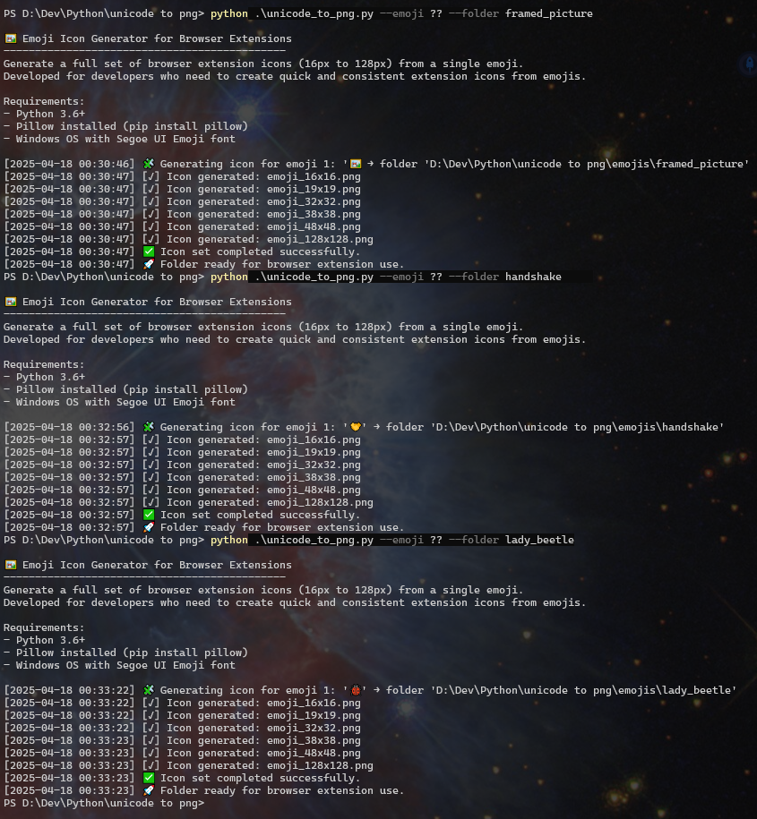

# 🖼️ unicode_to_png


---

## 📖 Table of Contents

- 📌 [Description](#-description)
- ✨ [Features](#-features)
- ⚙️ [How It Works](#️-how-it-works)
- 🛠️ [Options Available](#️-options-available)
- 💡 [Recommended Configurations/Use](#-recommended-configurationsuse)
- 🧱 [Technical Design](#-technical-design)
- 📦 [Installation](#-installation)
- 🔒 [Privacy](#-privacy)
- 📄 [License](#-license)
- 🧾 [Changelog](#-changelog)
- 💡 [Use Cases](#-use-cases)
- ⚠️ [Edge Cases Warnings](#️-edge-cases-warnings)
- 🤝 [Contributions](#-contributions)

---

## 📌 Description

**unicode_to_png v1.10** is a professional-grade Python script that generates browser-compatible PNG icons from emoji characters. It's tailored for developers building browser extensions or tools requiring well-structured icon sets for each emoji. This script is designed for Windows OS. Compatibility on other platforms may require adjustments.

---

## ✨ Features

- Generate icon sets in standard sizes (16×16 to 128×128 px).
- Supports single emojis or batch processing with aliases.
- CLI-based and interactive fallback.
- Output stored in structured subfolders.
- Logging only if warnings or errors occur.
- Cross-platform Unicode compatibility (Windows-optimized).
- Silent mode for automation pipelines.
- Safe file naming and folder sanitization.

---

## ⚙️ How It Works

1. The script receives one or more emoji inputs (via `--emoji` or `--batch`).
 ⚠️ **Important:** This script only supports valid [Unicode emoji characters](https://unicode.org/emoji/charts/full-emoji-list.html).  
 It does **not** accept regular letters, ASCII symbols, dingbats, or non-emoji Unicode characters.
2. It renders the emoji using the Segoe UI Emoji font on a high-resolution canvas.
3. The image is centered, scaled, and downsampled to standard icon sizes.
4. Each size is saved as a transparent `.png` file.
5. Output is structured in subfolders named using a base + alias format.
6. A log file is created **only if** any warning, overwrite, or error occurs.

### 🖼️ Visual Preview

Below are examples of how the script operates and what kind of output it produces:

#### 🧪 CLI Usage Demo



#### 📁 Folder Output Overview

This image shows how emoji icon sets are stored after generation.


#### 🔍 All Sizes Generated (Example: 🤝 Handshake Emoji)

A detailed view of the PNG files produced in various sizes from a single emoji.


### ✅ Usage Examples

```bash
# Single emoji, interactive folder name
python unicode_to_png.py --emoji "🧠"

# Batch emoji with aliases, using predefined folder base
python unicode_to_png.py --batch "🔥:fire,🎮:game" --folder my_pack

# Silent batch processing for automation
python unicode_to_png.py --batch "🖼️:frame,💡:idea" --folder assets --quiet
```

---

## 🛠️ Options Available

| Option        | Type     | Description |
|---------------|----------|-------------|
| `--emoji`     | string   | Single emoji to generate |
| `--folder`    | string   | Base name for the output folder |
| `--batch`     | string   | Comma-separated list of emoji:alias pairs |
| `--quiet`     | flag     | Suppresses console output (logging still active if needed) |

---

## 💡 Recommended Configurations/Use

- Always run in **Windows** to ensure emoji font rendering works correctly.
- Use the `--batch` option with `alias` to produce cleaner folder names:

  ```bash
  python unicode_to_png.py --batch "🔥:fire,🎮:game" --folder my_pack
  ```

- Use `--quiet` in automation or when calling from other scripts.

---

## 🧱 Technical Design

The script was designed with modularity, robustness, and automation in mind. Key engineering details:

### 📁 Directory Structure

- `emojis/<base>_<alias>/` → Generated icons
- `log/YYYYMMDD_<base>_<alias>.log` → If errors or warnings occur

### 🎨 Rendering Pipeline

- Emoji is rendered to a temporary high-resolution canvas (4× target size).
- Bounding box is calculated using `draw.textbbox()`.
- Emoji is centered using dynamic offsets from the bounding box.
- Image is downsampled to 16x16, 19x19, ..., 128x128 using `Image.LANCZOS`.

### 🧰 Font Support

- Uses `seguiemj.ttf` (Segoe UI Emoji), preinstalled on Windows.
- Falls back to `ImageFont.load_default()` if not available (non-colored).

### 🧪 CLI Design

- Built with `argparse`.
- Supports batch execution with aliases (`--batch "🔥:fire"`).
- All parameters are optional unless needed in context.
- Supports silent mode for integration into CI/CD pipelines.

### 🛡️ Validations & Controls

- Python version check: `>= 3.6`
- Pillow version check: `>= 9.0`
- OS check: optimized for Windows (others will warn).
- Emoji input must be printable.
- Folder and alias names sanitized to avoid filesystem issues.
- Transparent images are checked to detect rendering failures.
- File overwrites are logged with `[!] Overwriting:` indicator.

### 🧩 Modularity

- All core logic resides inside `main()`.
- CLI parsing isolated in `parse_args()`.
- Batch logic separated in `parse_batch()` for testability and clarity.
- Logging isolated and reusable (`log(...)`, `write_log_if_needed(...)`).

---

## 📦 Installation

### 📥 For Regular Users

⚠️ This script is currently CLI-only. No executable (.exe) is available at this time.

1. Open your terminal or command prompt.
2. Navigate to the folder where `unicode_to_png.py` is located.
3. Run: `python unicode_to_png.py --emoji "🎮"`

### 💻 For Advanced Users

#### I) 🐧 Unix-based Systems (Linux/macOS)

> ⚠️ Emoji rendering is **not guaranteed** due to missing color font support.

```bash
python3 -m venv env
source env/bin/activate
pip install -r requirements.txt
python unicode_to_png.py --emoji "🎮" --folder gaming
```

#### II) 🗔 Windows Systems

```bash
py -m venv env
env\Scripts\activate
pip install -r requirements.txt
python unicode_to_png.py --batch "🔥:fire,🎮:game" --folder my_icons
```

---

## 🔒 Privacy

This script:

- Does **not** collect, transmit, or store any personal data.
- Does **not** access internet or external APIs.
- Works entirely offline.
- Only creates output folders and images based on your input.

✅ 100% local, privacy-respecting, and safe for commercial and personal use.

---

## 📄 License

This project is licensed under the **Mozilla Public License 2.0 (MPL-2.0)**.  
See [LICENSE](LICENSE) for full terms.

---

## 🧾 Changelog

See [CHANGELOG.md](CHANGELOG.md) for details on recent updates.

---

## 💡 Use Cases

- Generating favicon sets for custom projects.
- Creating theme-based emoji icon packs.
- Browser extension developers who need high-res icons.
- Design workflows requiring emoji assets in consistent formats.

---

## ⚠️ Edge Cases Warnings

- Emojis not supported by your OS font may render blank.
- Composite emojis might require ZWJ support (`👨‍👩‍👧‍👦`).
- Folder names must be valid (automatically sanitized).
- On non-Windows platforms, emoji rendering may fail or appear monochrome.

---

## 🤝 Contributions

Contributions are welcome! To submit a feature, report a bug, or improve documentation:

1. Fork the repository
2. Create a new branch (`feature/my-feature`)
3. Submit a Pull Request

---

### 🏷️ Project Qualities


