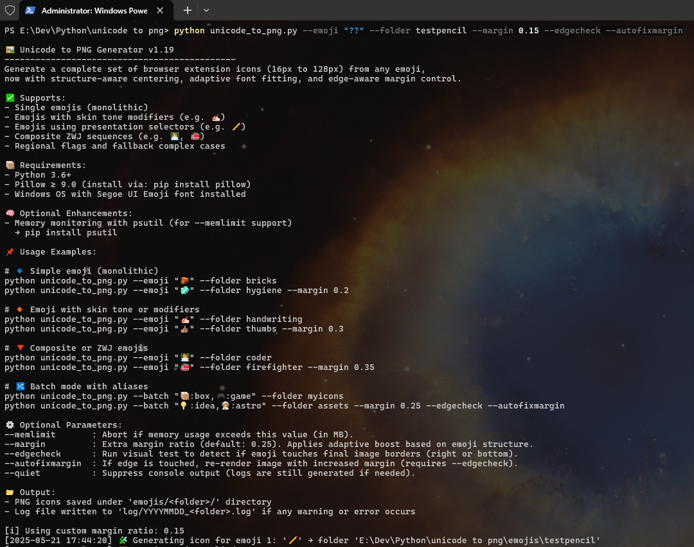
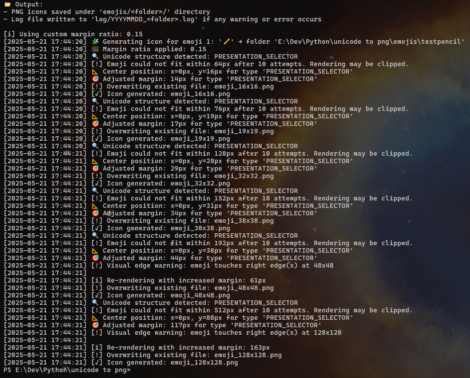
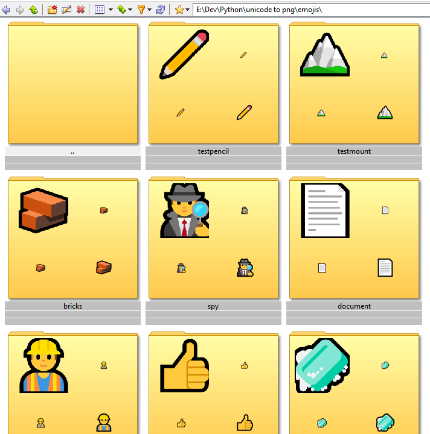
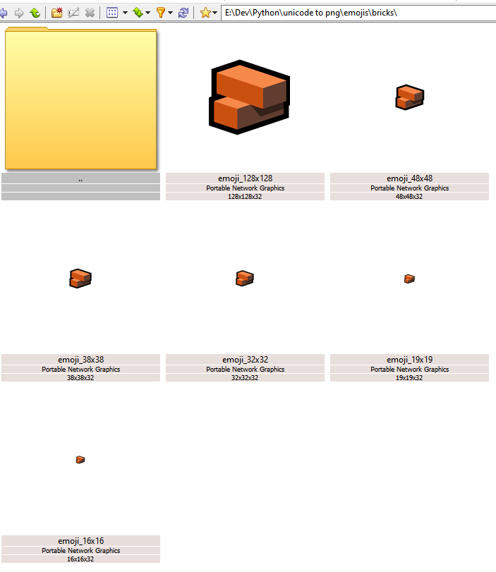

# 🖼️ unicode_to_png


---

## 📖 Table of Contents

- [Description](#description)
- [Features](#features)
- [How It Works](#how-it-works)
- [Options Available](#options-available)
- [Recommended Configurations/Use](#recommended-configurationsuse)
- [Technical Design](#technical-design)
- [Installation](#installation)
- [Privacy](#privacy)
- [License](#license)
- [Changelog](#changelog)
- [Use Cases](#use-cases)
- [Edge Cases & Warnings](#edge-cases--warnings)
- [Support the Project](#support-the-project)
- [Contributions](#contributions)
- [Governance & Ethics](#governance--ethics)

---

## 📌 Description

**Unicode to PNG v1.19** is a professional-grade emoji rendering engine tailored for browser extension developers, UI/UX designers, and automation engineers.

This script transforms any Unicode emoji—including single glyphs, composite sequences, skin tone modifiers, and complex ZWJ compositions—into high-resolution `.png` icons optimized for browser use (e.g., Chrome, Firefox, Edge).

With robust emoji parsing, strict validation, and automatic rendering margin adjustments, this tool guarantees visual consistency across all icon sizes.

🧩 Built for Windows, but script-aware of cross-platform limitations.

---

## ✨ Features

- 🖼️ **High-Quality Icon Generation**  
  Produces crisp `.png` icons in all standard sizes: **16x16**, **19x19**, **32x32**, **38x38**, **48x48**, and **128x128**, ideal for browser extensions, web stores, and UI design.

- 🧩 **Unicode-Aware Engine**  
  Fully supports:
  - Single Unicode glyphs (e.g., 🧠)
  - Skin tone modifiers (e.g., 👍🏻, 🙌🏿)
  - Presentation selectors (e.g., ✌ vs ✌️)
  - Complex ZWJ sequences (e.g., 👨‍👩‍👧‍👦, 🧑‍🚒‍🚒)
  - Flag/tags (e.g., 🇨🇱, 🏴)

- ⚙️ **Automatic Margin Compensation**  
  Smart margin rendering ensures that emojis aren’t cropped at the top or right. Optional `--margin` or `--autofixmargin` lets the engine adjust bounding boxes on-demand.

- 🧪 **Dual Input Mode**  
  - CLI: `--emoji`, `--batch` for scripting or CI/CD.
  - Interactive prompt fallback when no args are passed.

- 🗂️ **Structured Output**  
  Icons are saved inside: `emojis/<folder_base>_<alias>/`  
  Logs (if any) stored in: `log/YYYYMMDD_<folder>.log`

- 🔇 **Silent Mode**  
  Use `--quiet` for fully silent operation—ideal for automation or scripting.

- 🧹 **Sanitized Folder Naming**  
  All folder and alias inputs are automatically cleaned to avoid invalid filesystem characters.

- 🔍 **Safe Logging System**  
  Warnings, overwrites, and unexpected events are logged with timestamps. No noise unless necessary.

- 🖥️ **Optimized for Windows**  
  Leverages `Segoe UI Emoji` for rich colored rendering on Windows 10/11. Falls back gracefully if missing.

- ✅ **Minimal Requirements**  
  - Python ≥ 3.6  
  - Pillow ≥ 9.0  
  - No external API or web access needed

---

## ⚙️ How It Works

The Unicode to PNG engine follows a precise and scalable rendering pipeline to convert any valid emoji character into browser-ready `.png` icons. Here's how:

1. 🧾 **Input Handling**  
   - Accepts `--emoji` (single) or `--batch` (multiple emoji:alias pairs).  
   - If no arguments are passed, the script runs in interactive mode prompting the user.

2. 🧼 **Sanitization & Validation**  
   - All folder names and aliases are cleaned to remove unsafe characters.  
   - Emoji inputs must be printable Unicode characters.  
   - OS, Python, and Pillow versions are checked to ensure compatibility.

3. 🎨 **High-Resolution Rendering**  
   - A temporary canvas is created at 4× the target icon size.  
   - Emoji is rendered using `Segoe UI Emoji` (if available) with `embedded_color=True`.  
   - Bounding box (`textbbox`) is calculated to center the emoji precisely.

4. 🧠 **Smart Margin Correction (Optional)**  
   - If `--autofixmargin` is used, the system detects visual cropping (top/right clipping) and reapplies the render with a padded margin.  
   - Ensures clean and professional-looking results at all sizes.

5. 🖼️ **Icon Downsampling**  
   - Final output sizes: 16x16, 19x19, 32x32, 38x38, 48x48, 128x128.  
   - Resizing uses `Image.LANCZOS` for smooth scaling with no aliasing.

6. 📁 **Output Organization**  
   - Icons are saved in `emojis/<base>_<alias>/`  
   - If any warnings, errors, or overwrites occur, they are logged into `log/YYYYMMDD_<base>_<alias>.log`

7. 📡 **Silent Automation Support**  
   - Use `--quiet` to suppress output in automation pipelines while preserving log creation.

8. 🧩 **Composite Emoji Handling**  
   - ZWJ sequences (👨‍👩‍👧‍👦), skin tones, gender variations, and presentation modifiers are rendered correctly and preserved during export.

---

### 🖼️ Visual Preview

Below are examples of how the script operates and what kind of output it produces:

#### 🧪 CLI Usage Demo




#### 📁 Folder Output Overview

This image shows how emoji icon sets are stored after generation.



#### 🔍 All Sizes Generated (Example: 🤝 Handshake Emoji)

A detailed view of the PNG files produced in various sizes from a single emoji.



---

### ✅ Usage Examples

Below are complete command-line examples for generating emoji-based icons for browser extensions or automation pipelines.

---

#### 🔹 Single Emoji (Interactive Folder Prompt)

Generates all standard icon sizes (16px to 128px) for a single emoji. The script will prompt for the output folder name if `--folder` is not provided.

```bash
python unicode_to_png.py --emoji "🧠"
```

- Output: `emojis/emoji/emoji_16x16.png`, ..., `emoji_128x128.png`
- Use this for quick generation of a single emoji icon pack.

---

#### 🔹 Single Emoji with Custom Folder Name

Saves the icons into a user-defined subfolder under the `emojis/` directory.

```bash
python unicode_to_png.py --emoji "🎮" --folder gaming_icon
```

- Output path: `emojis/gaming_icon/emoji_*.png`
- Useful when organizing icons for specific purposes (e.g., themes or features).

---

#### 🔹 Batch Mode with Aliases

Processes multiple emojis at once and assigns a custom alias to each one. All outputs are saved in separate subfolders under the same base folder name.

```bash
python unicode_to_png.py --batch "🔥:fire,🎨:palette,🧪:lab" --folder science_pack
```

- Output paths:
  - `emojis/science_pack_fire/emoji_*.png`
  - `emojis/science_pack_palette/emoji_*.png`
  - `emojis/science_pack_lab/emoji_*.png`

- This mode is ideal for generating sets of themed icons.

---

#### 🔹 Quiet Mode for Automation and CI/CD

Suppresses console output while still generating logs when needed. Ideal for integrating the tool into build pipelines or scripts.

```bash
python unicode_to_png.py --batch "📦:package,🚀:rocket" --folder release_assets --quiet
```

- No console output.
- Log files (if issues occur): `log/YYYYMMDD_release_assets_*.log`

---

#### 🔹 Smart Margin Correction (Auto)

Avoids visual clipping when rendering emojis with complex shapes or compositions (e.g., ZWJ or skin tones). Automatically re-renders with an adjusted margin if needed.

```bash
python unicode_to_png.py --emoji "👨‍🚀" --folder astronaut --autofixmargin
```

- Detects when an emoji touches the canvas edge and corrects the layout.
- Recommended for complex glyphs that render inconsistently.

---

#### 🔹 Manual Margin Control

Allows the user to specify a fixed margin (as a percentage of canvas size). Helps in cases where extra padding is desired around the emoji.

```bash
python unicode_to_png.py --emoji "🎯" --folder target_icon --margin 0.25
```

- Adds a 25% margin around the emoji.
- Useful for UI alignment or icons that need to be spaced consistently.

---

#### 🔹 Combined Automation: Batch + Quiet + Autofix

Powerful combo for headless batch rendering with minimal maintenance. Ideal for continuous integration environments or nightly builds.

```bash
python unicode_to_png.py --batch "👩‍💻:developer,🧑‍🚒:firefighter" --folder heroes --quiet --autofixmargin
```

- Fully silent mode.
- Auto-corrects rendering margins.
- Generates logs only if necessary.

---

## 🛠️ Options Available

All command-line options are optional unless noted. They can be combined for powerful customization and automation.

| Option            | Type     | Required | Description                                                                 |
|-------------------|----------|----------|-----------------------------------------------------------------------------|
| `--emoji`         | string   | No       | A single emoji to convert (e.g., `"🧠"`).                                   |
| `--batch`         | string   | No       | Comma-separated list of emoji:alias pairs (e.g., `"🔥:fire,🎮:game"`).      |
| `--folder`        | string   | No       | Base name for output folder(s). Sanitized to avoid invalid characters.     |
| `--quiet`         | flag     | No       | Suppresses all console output. Logging still occurs if warnings/errors.    |
| `--margin`        | float    | No       | Adds manual margin (e.g., `0.25` = 25%) around emoji.                      |
| `--autofixmargin` | flag     | No       | Automatically detects and adjusts margins if visual cropping is detected.  |

---

### 🧩 Notes on Parameters

- **`--emoji` vs `--batch`**: Only one of them should be used at a time.
- **Aliases in `--batch`** are required for meaningful folder naming (e.g., `🎮:game`).
- **`--folder`** is appended to each alias to generate subfolder names.
- **Margins**:
  - `--margin` is manually specified.
  - `--autofixmargin` triggers a visual analysis during rendering and re-renders if necessary.

---

### 🛡️ Safety & Validation

- All folder and alias names are cleaned to use only letters, numbers, and underscores.
- Emoji input must be printable Unicode.
- If both `--margin` and `--autofixmargin` are used, `--autofixmargin` takes precedence.
- The script will halt gracefully with clear error messages if any invalid input is detected.

---

## 💡 Recommended Configurations/Use

These recommendations help ensure clean rendering, consistent icon naming, and full automation compatibility across development environments.

---

### ✅ Use Windows for Best Emoji Rendering

Although the script may run on Unix/macOS, **only Windows** guarantees full color emoji rendering due to native support for the `Segoe UI Emoji` font.

- **Required**: Windows 10 or newer
- **Font dependency**: `C:/Windows/Fonts/seguiemj.ttf`

---

### ✅ Use `--batch` with Aliases for Themed Icon Sets

```bash
python unicode_to_png.py --batch "📚:books,🧪:science,🚀:launch" --folder edu_pack
```

This produces structured output:

```
emojis/
 ├── edu_pack_books/
 ├── edu_pack_science/
 └── edu_pack_launch/
```

---

### ✅ Use `--quiet` for Automation or CI/CD Pipelines

Integrate the script into GitHub Actions, scheduled tasks, or custom build systems:

```bash
python unicode_to_png.py --batch "🎯:focus,💡:idea" --folder assets --quiet
```

All logs are written to the `log/` directory if needed, but console remains silent.

---

### ✅ Use `--autofixmargin` to Avoid Emoji Cropping

To prevent clipped edges in visually dense emojis:

```bash
python unicode_to_png.py --emoji "🧑‍🚒" --folder fire_icon --autofixmargin
```

The engine re-renders with an internal margin if any edge is visually cropped.

---

### ✅ Use `--margin` When Precise Layout Control Is Required

For pixel-perfect UI requirements, apply a fixed margin:

```bash
python unicode_to_png.py --emoji "🎯" --folder centered_icon --margin 0.2
```

- Recommended for tightly-aligned interface icons.

---

### 🔄 Combine Parameters for Full Automation

Use all relevant options together for consistent, silent, and safe output:

```bash
python unicode_to_png.py --batch "🧠:brain,🖥️:desktop" --folder product_icons --quiet --autofixmargin
```

- Great for production pipelines, versioned builds, or marketing asset generation.

---

## 🧱 Technical Design

The Unicode to PNG generator was engineered with modularity, robustness, and automation in mind. This section breaks down the internal architecture, control layers, and rendering pipeline.

---

### 📁 Directory Structure

All output and logs follow a clear, isolated, and predictable structure:

```
project_root/
 ├── emojis/
 │    ├── <folder_base>_<alias>/
 │    │     ├── emoji_16x16.png
 │    │     ├── ...
 │    │     └── emoji_128x128.png
 └── log/
      └── YYYYMMDD_<folder>.log
```

---

### 🎨 Rendering Pipeline

1. **High-Resolution Canvas Generation**
   - Temporary canvas is created at 4× the final size.
   - Transparent background (`RGBA` mode).

2. **Font Loading**
   - Attempts to load `Segoe UI Emoji` (`seguiemj.ttf`) from Windows fonts.
   - If unavailable, falls back to `ImageFont.load_default()` (non-colored glyphs).

3. **Bounding Box Measurement**
   - Uses `draw.textbbox(...)` to calculate the emoji bounds.
   - Helps with exact centering regardless of emoji width or composition.

4. **Margin Adjustment**
   - If `--margin` is used: extra padding is manually added.
   - If `--autofixmargin` is active: re-renders if edge pixels suggest clipping.

5. **Downsampling**
   - Resizing from temporary canvas to final size uses `Image.LANCZOS` (high-quality).

6. **Output Naming**
   - Output files: `emoji_<size>x<size>.png` (e.g., `emoji_48x48.png`).
   - Saved in sanitized subfolder `emojis/<base>_<alias>/`.

---

### 🧰 Font Support

- Preferred: `Segoe UI Emoji` (`seguiemj.ttf`) with color support.
- Fallback: PIL default font (monochrome; last resort).
- The font must support full Unicode emoji ranges including ZWJ and skin tones.

---

### 🧪 CLI Structure

- Built with `argparse`.
- All options are optional, with fallbacks to interactive mode.
- Batch execution via `--batch` supports `emoji:alias` pairs.
- Flag `--quiet` disables all stdout output, ideal for silent automation.

---

### 🛡️ Validations & Error Controls

- **Python version**: requires ≥ 3.6.
- **Pillow version**: requires ≥ 9.0.
- **OS check**: warns if not running on Windows.
- **Emoji input**: must be printable and valid.
- **Folder/alias names**: sanitized to allow only `[a-zA-Z0-9_]`.
- **Rendering safety**: verifies transparent image result and logs warnings.
- **File overwrite detection**: notifies if `emoji_*.png` is being replaced.

---

### 🧩 Modularity

Each functionality is clearly isolated for maintainability and testability:

- `main()`: high-level orchestration.
- `parse_args()`: CLI argument handling.
- `parse_batch()`: emoji batch logic and alias assignment.
- `log()` / `write_log_if_needed()`: consistent, timestamped logging.
- `load_font()`: font loading abstraction with fallback logic.
- `prepare_log_path()`: automatic log path management.

---

### 🛡️ Engineering Principles

Unicode to PNG follows high technical standards to ensure reliability, performance, and resilience in all environments:

- **Error Handling**  
  Each functional block includes robust `try/except` logic to isolate and handle exceptions gracefully.

- **Memory Management**  
  All image objects, buffers, and rendering artifacts are destroyed or released after use to minimize memory footprint.

- **Zero Bottlenecks**  
  No persistent loops, idle timers, or unused listeners are created. The script exits cleanly after execution.

- **Defensive Programming**  
  The tool is designed to continue functioning even in edge cases such as unsupported emojis, missing fonts, or invalid input. Errors are logged; failures are contained.

asset practices ensure the script is safe for automation pipelines, resource-constrained systems, and batch processing.

---

## 📦 Installation

### 📥 For Regular Users

⚠️ This script is currently CLI-only. No executable (.exe) is available at this time.

1. Open your terminal or command prompt.
2. Navigate to the folder where `unicode_to_png.py` is located.
3. Run: `python unicode_to_png.py --emoji "🎮"`

### 💻 For Advanced Users

#### I) 🐧 Unix-based Systems (Linux/macOS)

> ⚠️ Emoji rendering is **not guaranteed** due to missing color font support.

```bash
python3 -m venv env
source env/bin/activate
pip install -r requirements.txt
python unicode_to_png.py --emoji "🎮" --folder gaming
```

#### II) 🗔 Windows Systems

```bash
py -m venv env
env\Scripts\activate
pip install -r requirements.txt
python unicode_to_png.py --batch "🔥:fire,🎮:game" --folder my_icons
```

---

## 🔒 Privacy

This script:

- Does **not** collect, transmit, or store any personal data.
- Does **not** access internet or external APIs.
- Works entirely offline.
- Only creates output folders and images based on your input.

✅ 100% local, privacy-respecting, and safe for commercial and personal use.

---

## 📄 License

This project is licensed under the **Mozilla Public License 2.0 (MPL-2.0)**.  
See [LICENSE](LICENSE) for full terms.

---

## 🧾 Changelog

See [CHANGELOG.md](CHANGELOG.md) for details on recent updates.

---

## 💡 Use Cases

The Unicode to PNG script was designed to meet real-world demands across several professional domains. Below are key usage scenarios where this tool excels.

---

### 🧩 Browser Extension Development

Generate complete sets of action icons, toolbar icons, and promotional graphics using emojis as visual identifiers.

- Favicons: `emoji_16x16.png`
- Toolbar/Popup icons: `emoji_19x19.png`, `emoji_38x38.png`
- Store Listing: `emoji_128x128.png`
- Example: Build Chrome/Firefox extensions with visual branding using emojis.

---

### 🎨 Design & Prototyping Workflows

Quickly convert emojis into transparent icons to use in wireframes, mockups, or UI presentations.

- Ideal for Figma, Adobe XD, or Sketch workflows.
- Emojis are rendered consistently without needing to copy-paste from web sources.

---

### 🧪 Automation in CI/CD Pipelines

Integrate into asset generation steps within your build system. Automatically create icons during packaging or release workflows.

- Combine with GitHub Actions, Jenkins, or local build scripts.
- Use `--quiet` and `--autofixmargin` for zero-interaction stability.

---

### 📦 Asset Bundling for Themed Interfaces

Create visual identity packs using emoji-based icons for:

- Messaging platforms
- Educational apps
- Enterprise dashboards
- Onboarding screens

Supports `--batch` with aliases for themed folders (e.g., `onboarding_fire, onboarding_chat`).

---

### 🧠 Learning Tools or Educational Projects

Generate image assets for quizzes, flashcards, or gamified learning experiences.

- Helps educators or developers introduce visual stimuli without relying on third-party icons.
- Each emoji becomes a reusable asset with guaranteed size and transparency.

---

### 🔍 Testing Emoji Rendering Across Platforms

Use the script to visually validate how specific emojis appear with different settings:

- Skin tone modifiers
- ZWJ compositions
- Flag sequences
- Presentation selectors

Great for developers building emoji-aware systems or conducting visual regression tests.

---

### 📂 Offline Emoji Icon Repository Creation

Build your own local emoji asset library, free from licensing restrictions or internet dependencies.

- All output is local and reusable.
- 100% offline and privacy-safe.

---

## ⚠️ Edge Cases & Warnings

While the script is robust and production-ready, the following edge cases and platform-specific behaviors should be considered to ensure consistent results.

---

### 🚫 Font Not Available or Incompatible

- If `Segoe UI Emoji` is not installed or cannot be loaded:
  - The script will fall back to a default PIL font.
  - Emoji rendering may be monochrome, incomplete, or blank.
- **Fix**: Ensure the presence of `C:/Windows/Fonts/seguiemj.ttf`.

---

### ❌ Rendering Blank or Transparent Icons

- If an emoji is unsupported or composed of invalid Unicode sequences:
  - The image may render as fully transparent.
- The script will log a warning:  
  `"Warning: Emoji may not have rendered at <size>x<size>"`

---

### 🧬 ZWJ or Flag Sequences May Break on Non-Windows Systems

- Emojis that rely on ZWJ (Zero Width Joiner) or flag tag sequences (e.g., `🇨🇱`, `👨‍👩‍👧‍👦`) might not render properly on Linux/macOS.
- These platforms often lack native color font support.

---

### 🧩 Margin Issues on Complex Emojis

- Some emojis with internal joins or stacked glyphs may render cropped at the top or right edge.
- **Fix**: Use `--autofixmargin` or manually apply `--margin 0.25`.

---

### 📂 Invalid Folder Names

- Folder names with invalid characters (e.g., `#`, `@`, spaces) are automatically sanitized.
  - Input: `"🔥 pack!"` → Output folder: `fire_pack`
- No user intervention required, but aliases may differ from original input.

---

### 🛑 Mixed Inputs (emoji + batch)

- Do not use `--emoji` and `--batch` simultaneously.
  - The script will prioritize `--batch` if both are present, but behavior is undefined.
- Stick to one mode per execution.

---

### ⚙️ High DPI Screens May Influence Preview

- Icons generated at 128x128 will appear crisp when inspected or previewed.
- However, actual rendering in browsers depends on CSS scaling and display resolution.

---

### 📤 External Use in Non-Standard Environments

- When running in containers, remote terminals, or CI runners:
  - Font rendering may fail if the environment lacks GUI font subsystems.
  - Always test locally before deploying in headless pipelines.

---

### 💾 Overwriting Files

- If output files already exist (e.g., `emoji_48x48.png`):
  - The script will overwrite them and log: `[!] Overwriting existing file: ...`
- No backups are created by default.

---

## 💖 Support the Project

**Unicode to PNG** is a free and open-source tool maintained during personal time.  
If it has helped you save time or improve your workflow, consider supporting its continued development:

- 💸 [Donate via PayPal](https://paypal.me/spalmah?country.x=CL&locale.x=es_XC)

> 🙏 Every bit of support is truly appreciated.  
> 💬 Feel free to reach out with questions, ideas, or feedback — your input matters!

---

## 🤝 Contributions

We welcome contributions of all kinds — whether you're fixing bugs, adding new features, improving documentation, or helping with translations.

---

### 🔧 How to Contribute

1. **Fork the Repository**  
   Navigate to [https://github.com/del-Pacifico/unicode_to_png](https://github.com/del-Pacifico/unicode_to_png) and click on "Fork".

2. **Create a New Branch**  
   Use a descriptive name for your branch (e.g., `feature/batch-validation`):

   ```bash
   git checkout -b feature/my-feature
   ```

3. **Make Your Changes**  
   Ensure code follows Python best practices and includes proper docstrings and inline comments.

4. **Test Locally**  
   Before submitting, verify that your changes do not break existing functionality. Run:
   ```bash
   python unicode_to_png.py --emoji "🎯" --folder test_icon
   ```

5. **Submit a Pull Request**  
   Include a clear title and description of your change. Use GitHub's PR templates if available.

---

### 🧪 Guidelines

- Use English for all code, comments, and commits.
- Write meaningful commit messages.
- Prefer modular, testable code.
- Avoid breaking changes unless previously discussed.
- Include examples in the README if introducing new features.

---

### 🌍 Want to Translate or Adapt?

If you're interested in adapting the tool for other platforms (e.g., Linux-native rendering) or creating multilingual documentation, feel free to open an issue and propose your idea.

---

### 📬 Need Help Before Contributing?

Feel free to open a GitHub Discussion or an Issue if you're unsure how to start or have questions about the internal logic.

We’re happy to support contributors at all experience levels.

---

## 📚 Governance & Ethics

- 🔐 [Security Policy](./SECURITY.md) — How we manage vulnerabilities and review AI-assisted code.
- 🙌 [Contribution Guidelines](./CONTRIBUTING.md) — How to collaborate, submit PRs, and use AI responsibly.

---


<!-- BADGE GROUP: QUALITY -->


<!-- 👇 AI-related badges group -->


